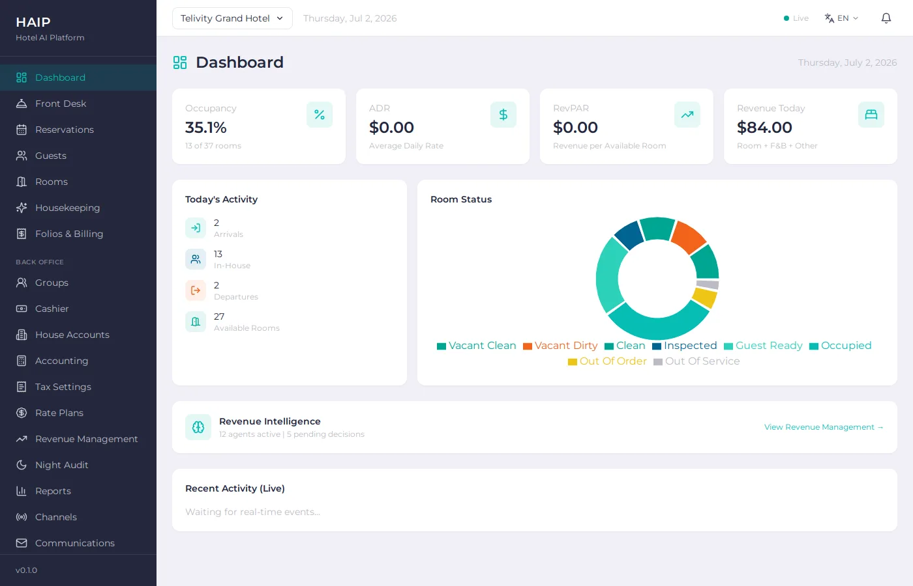
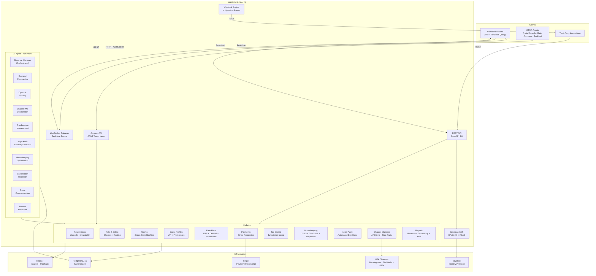

<p align="center">
  
</p>

<h1 align="center">HAIP — Hotel AI Platform</h1>

<p align="center">
  <strong>The open-source, API-first hotel PMS where AI agents are first-class citizens.</strong>
</p>

<p align="center">
  <a href="https://github.com/TelivityAI/haip/actions"></a>
  
  
  
  
  
</p>

<p align="center">
  
</p>

<p align="center">
  <a href="#what-is-haip">What is HAIP</a> &middot;
  <a href="#architecture">Architecture</a> &middot;
  <a href="#ai-agents">AI Agents</a> &middot;
  <a href="#features">Features</a> &middot;
  <a href="#tech-stack">Tech Stack</a> &middot;
  <a href="#quick-start">Quick Start</a> &middot;
  <a href="#api-reference">API Reference</a> &middot;
  <a href="#otaip-integration">OTAIP Integration</a> &middot;
  <a href="#contributing">Contributing</a>
</p>

---

## What is HAIP

The hotel industry runs on closed-source, legacy PMS platforms that charge per-room fees, lock data behind proprietary APIs, and treat integrations as an afterthought. Hotels pay $5–15/room/month just for the privilege of managing their own operations.

HAIP is a **complete, production-grade hotel Property Management System** built from scratch with modern architecture. Reservation lifecycle, folio & billing, rate plans, housekeeping with digital checklists, night audit, channel distribution to 450+ OTAs, a **full commission-free direct booking engine** (guest-facing widget + public booking API) so hotels take reservations straight from their own website, Stripe payment processing, Keycloak authentication, local user & role administration, media management for property and room photos, tax calculation engine, revenue management — and **12 built-in AI agents** that orchestrate revenue strategy, optimize pricing, predict cancellations, detect audit anomalies, prioritize receivables collections, forecast group pickup, schedule housekeeping, automate guest communications, and draft review responses. It even ships a **ChatGPT gateway** so guests can search and book a room by chatting. All open source under Apache 2.0.

What makes HAIP different is that **AI agents are built into the architecture from day one** — not as a bolt-on, but as first-class citizens with their own lifecycle, decision logging, and per-property calibration (deterministic engines that learn each hotel's own rates from its history — not LLMs pretending to be agents). HAIP is the sister project to [OTAIP](https://github.com/telivity-otaip/otaip) (Open Travel AI Platform). Together they form **Telivity's open-source travel infrastructure**. OTAIP agents connect to HAIP via the Connect API — the PMS works without AI, but the AI makes it extraordinary.

### What HAIP is NOT

HAIP is not a wrapper around another PMS. It's not a SaaS dashboard with "AI" slapped on the marketing page. It's a real PMS with real hotel operations logic — night audits at 3am, folio routing rules, rate parity enforcement, guest registration compliance across jurisdictions. And it ships a **commission-free direct booking engine** so a hotel can take bookings straight from its own website — keeping the 15–25% an OTA would take.

---

## Architecture



**Option B Architecture** — The PMS is standalone. It works without OTAIP. OTAIP agents sit on top via the Connect API, using purpose-built endpoints for AI agent workflows.

### Key Design Decisions

- **Multi-tenant from day one** — `property_id` on every table, designed for portfolio operators managing multiple hotels
- **Event-driven** — Webhook events on every state change (`reservation.created`, `folio.charge_posted`, `room.status_changed`). Build anything on top.
- **AI agents as first-class citizens** — 12 built-in agents with a common interface: `analyze() → recommend() → execute()`, coordinated by a Revenue Manager orchestrator. Three operating modes: manual, suggest, autopilot. Decision logging for continuous learning.
- **ChannelAdapter pattern** — Same abstraction as OTAIP's ConnectAdapter. Booking.com + Expedia (EQC) direct adapters plus SiteMinder and DerbySoft aggregators for 450+ OTA reach — distributing **both** ARI and descriptive content (photos/descriptions/amenities).
- **Layered RBAC** — Keycloak JWT authentication **plus HAIP's own local users, roles & permissions**: a code-defined permission catalog, operator-defined custom roles, and guards (`@Roles` + `@RequirePermissions`) on every endpoint.
- **Polymorphic media** — One image model for properties, room types & rooms; add by URL (zero infra) or upload to S3/MinIO, with one enforced primary per owner.
- **Compliance as infrastructure** — PCI tokenization (Stripe), GDPR audit trails, jurisdiction-based tax calculation, guest registration per jurisdiction. Not bolted on — built in.
- **Real-time dashboard** — WebSocket broadcasting per property. Room status changes, new reservations, AI agent decisions — all pushed instantly.

---

## AI Agents

HAIP includes **12 built-in AI agents** — 5 for revenue management (including the Revenue Manager orchestrator), 5 for operations intelligence, and 2 for guest engagement. Every agent follows the `HaipAgent` interface:

```
analyze() → recommend() → execute() → recordOutcome() → train()
```

### Operating Modes

| Mode | Behavior |
|------|----------|
| **Manual** | Agent analyzes and recommends. Human approves/rejects via dashboard. |
| **Suggest** | Agent recommends with confidence score. High-confidence decisions auto-execute. |
| **Autopilot** | Agent executes autonomously. All decisions logged for review. |

### Revenue Management Agents

| Agent | What It Does |
|-------|-------------|
| **Revenue Manager (RManager)** | The revenue **orchestrator**. Runs the levers below in dependency order (demand first, then pricing, overbooking, channel mix, group pickup) and reconciles them into one coherent strategy grounded in established RM doctrine: optimizes **GOPPAR** (profit per available room) over raw revenue, moves price with demand band and booking pace, protects peak dates with length-of-stay controls and zero overbooking, keeps the rate grid internally consistent, evaluates group displacement on net contribution, and treats discounting as a last resort. Surfaces conflicts between levers and projects RevPAR/GOPPAR across the horizon. |
| **Demand Forecasting** | Predicts future occupancy using weighted moving averages with day-of-week seasonality, booking pace, and last-minute demand signals. Heuristic model → statistical model progression. |
| **Dynamic Pricing** | Calculates optimal room rates based on demand tier, booking pace, lead-time decay, and weekend premiums. Enforces floor/ceiling rate constraints. |
| **Channel-Mix Optimization** | Ranks OTA channels by net revenue (gross × (1−commission) × (1−cancel_rate)). Recommends allocation shifts and stop-sell when occupancy exceeds thresholds. |
| **Overbooking Management** | Calculates optimal overbooking level using expected value optimization: (overbook revenue × fill probability) vs (walk cost × walk probability). Respects walk cost constraints. |

### Operations Intelligence Agents

| Agent | What It Does |
|-------|-------------|
| **Night Audit Anomaly Detection** | Scans checked-in reservations, folios, and closed cashier shifts for 8 anomaly types: unposted charges, missing tax, payment mismatches, stale check-ins, duplicate folios, no-show candidates, unusual charges, and cash-drawer variance outliers (z-score > 2.5 statistical outlier detection). Ranked by severity (critical/warning/info) and confidence. |
| **Housekeeping Optimization** | Builds workload-balanced cleaning schedules. Prioritizes VIP and early check-in rooms, groups by floor for route efficiency, estimates cleaning times by task type (checkout 30min, stayover 20min, deep clean 60min, suite 45min). |
| **Cancellation Prediction** | Scores every active reservation with a cancellation probability based on booking source (OTA 25% base vs direct 8%), deposit status, repeat guest history, VIP level, lead time, and days until arrival. Adds **deposit-forfeit risk** scoring on held deposits (likely-forfeit vs likely-refund exposure). Aggregates risk by date for overbooking decisions. |
| **A/R Collections Prioritization** | Ranks open Accounts Receivable ledgers by collection priority — weighing outstanding balance, days overdue beyond payment terms, and open transfer count — into low/medium/high risk tiers with a recommended action (monitor, send reminder, send final notice). |
| **Group Pickup Forecasting** | Projects final pickup vs. wash/attrition for each allotment block ahead of its cutoff date, using current pickup pace and historical pickup rate. Recommends hold / partial-release / full-release with a suggested release quantity to recover unsold inventory. |

### Guest Engagement Agents

| Agent | What It Does |
|-------|-------------|
| **Guest Communication** | Template-based lifecycle emails: confirmation, pre-arrival (3 days), day-of arrival, welcome (on check-in), post-stay, and win-back (90 days). **Event-driven drafts** on `reservation.created` / `checked_in` / `checked_out` via `GuestCommsListener`; scheduled types still from manual/cron `guest_comms/run`. Repeat vs first-time personalization. GDPR opt-out enforcement. Duplicate prevention via decision log. Configurable SMTP (defaults to draft-only). |
| **Review Response** | Drafts professional responses to guest reviews entered by staff. Keyword-based topic extraction across 10 categories (cleanliness, staff, value, noise, food, wifi, etc.). Sentiment classification from rating (1-2 negative, 3 mixed, 4-5 positive). Three response styles (formal/friendly/casual). Matches guests to reservations for stay-specific references. Template-based assembly — no LLM freeform text, no hallucination risk. |

### Decision Logging & per-property calibration

Every agent decision is persisted (input snapshot, recommendation, confidence, outcome)
as an audit trail. On top of that, agents **calibrate to each property's own history**:
running `train()` recomputes an agent's parameters from that hotel's real outcomes and
stores them in `agent_configs.modelState`, which `analyze()` then uses instead of the
cold-start defaults.

> **What this is — and isn't (read this).** The agents are **deterministic decision
> engines**, not LLMs — that's the point: they're the auditable guardrail. "Learning" here
> means **statistical calibration from your hotel's own data** (e.g. the cancellation agent
> learns this property's real cancel rates by booking source), not a neural net. Today the
> cancellation agent calibrates for real; the other history-rich agents follow the same
> pattern. The customer-comms and review-response agents are deterministic templates (no
> LLM, no hallucination) and do **not** "learn."

#### What learns vs. what's deterministic

| Agent | Today |
|---|---|
| Cancellation Predictor | **Calibrates** per-property cancel rates by source from history |
| Demand · Overbooking · Channel Mix | Deterministic; same calibration pattern is the roadmap |
| Pricing · Revenue Manager · Group Pickup · AR · Housekeeping · Night Audit | Deterministic math/rules |
| Guest Comms · Review Response | Deterministic templates (no LLM) |

**HAIP AI (optional):** a small, purpose-built **local** model (served via Ollama) that
adds a plain-language *explanation + suggestions* layer over any agent decision — strictly
grounded in that agent's own numbers, with the deterministic agent vetoing any figure it
didn't compute (so it can't invent a rate, a policy, or a number). It **explains and
suggests; it never executes** — approval always runs the agent's own recommendation. It
runs entirely on the property's own hardware (no cloud calls, no per-use fees, and no guest
data leaves the building) and is **off by default** — the PMS works fully without it.

Enable it:

```bash
# pull the model (Apache-2.0, ~5 GB), then turn it on
ollama pull hf.co/telivity/haip-ai
export HAIP_AI_ENABLED=true
export HAIP_AI_MODEL=haip-ai
```

---

## Features

### Shipped product slices

Recent backlog deliveries, mapped to the feature sections below. Each slice is a mergeable vertical cut — API + dashboard + tests — not a rewrite of the domain.

| # | Slice | Merged PR | What it does |
|---|-------|-----------|--------------|
| 1 | **Upsells / ancillaries** | [#174](https://github.com/telivityai/haip/pull/174) | Property services catalog, package components, attach extras to a stay, post on check-in / night audit, booking-engine extras step, optional pre-arrival upsell prompt. See **Stay Extras & Packages**. |
| 2 | **Money policy** | [#175](https://github.com/telivityai/haip/pull/175) | Cancellation policies on rate plans, shared cancel/no-show evaluator, deposit refund/forfeit/apply on cancel · no-show · check-in. See **Reservation Management** and **Accounting & Cashiering**. |
| 3 | **Front desk stay ops** | [#181](https://github.com/telivityai/haip/pull/181) | Arrivals / in-house queues, walk-in, in-house room move, registration card at check-in, operational notes at the desk. See **Reservation Management**. |
| 4 | **A/R & cashier polish** | [#180](https://github.com/telivityai/haip/pull/180) | List cash drawers/sessions, A/R ledger CRUD + aging UX, folio→A/R from folio detail, reverse-transfer picker. See **Accounting & Cashiering** and **Folio & Billing**. |
| 5 | **Commercial profiles** | [#180](https://github.com/telivityai/haip/pull/180) (also [#179](https://github.com/telivityai/haip/pull/179)) | Standing-account billing terms on group profiles; link A/R ledgers and negotiated rates; Commercial dashboard page. See **Groups & Commercial Profiles**. |
| 6 | **Guest journey ops** | [#182](https://github.com/telivityai/haip/pull/182) | Lifecycle guest-comms triggers, communications desk reject/run, registration settings, guest messaging UI, ID fields at check-in. See **Guest Management**. |
| 7 | **Housekeeping ops depth** | _(this PR)_ | Ops desk: room/housekeeper summaries, urgent rooms, interactive checklists, staff assign/unassign, VIP auto-priority, analytics KPIs, `housekeeping.read` / `housekeeping.manage` permissions. See **Housekeeping**. |

### Direct Booking Engine (commission-free)
- A **public, guest-facing booking API** (`/api/v1/booking-engine/*`) a hotel puts behind its own website — search → quote → book → pay → confirm — capturing direct reservations with **zero OTA commission**.
- Authenticated by a per-property **publishable key** (`x-booking-key`): property-scoped, low-trust (it ships in client-side HTML), and restricted to search/quote/book and read-or-cancel-own-confirmation — it can never enumerate other reservations or tenants.
- Reuses the existing availability, rate, tax, reservation, folio and payment engines — prices are **re-quoted server-side** (never trusts a client price), payments are classified as a **deposit** liability (KB §10.5), and `reservation.created` fires so the channel manager pushes updated availability everywhere.
- **Embeddable widget app** (`apps/booking`) plus a dashboard **Settings → Booking Engine** tab to generate/rotate keys, choose sellable room types & rates, set branding, and configure the deposit policy.

### Data Migration & Import
- A generic **CSV import** on-ramp (`/api/v1/import/*`) for hotels switching from another PMS: upload a CSV, map columns, **dry-run** to validate, then commit — with **per-row error reporting** (one bad row never aborts the batch). Importers for guests, room types and rate plans, trivially extensible to more entities.

### Accounting Export
- Plain **CSV export** of the daily revenue journal and trial balance (`/api/v1/accounting-export/*`) to import into your own books (QuickBooks/Xero/spreadsheet) — no hosted connector required.

### Reservation Management
- Full lifecycle state machine: `pending → confirmed → assigned → checked_in → stayover → due_out → checked_out`
- Real-time availability engine with room type inventory
- Room assignment with automatic status transitions
- **Front desk stay ops** — arrivals / in-house queues (multi-status filters), walk-in create→assign→check-in, in-house **room move** (`PATCH …/move-room`, respects `doNotMove`), operational notes at the desk and on reservation detail
- **Guest registration at check-in** — registration card fields + `registrationSigned`; required when the property has `guestRegistrationRequired`
- Group check-in (batch operations)
- Bulk actions across multiple reservations (check-in / check-out / cancel) with per-reservation success/error results
- Reservation notes with active-count tracking
- Guest messaging from a reservation (GDPR marketing opt-out enforced)
- Unassigned-reservation finder (confirmed/assigned reservations with no room)
- Batch reservation import with per-row error handling
- Express checkout
- **Money policy** — property cancellation policies (free-cancel window, penalty type, deposit handling) linked from rate plans; shared evaluator for PMS / Connect / booking engine; deposit settlement on cancel, no-show, and check-in auto-apply
- No-show and cancellation handling with policy enforcement (reservation "un-cancel" is intentionally unsupported — a payment-integrity hazard; create a new reservation instead)
- Every state transition fires a webhook event and is audit-logged

### Stay Extras & Packages (Upsells)
- Property **services catalog** — sellable extras with charge type, price, posting rule (`once` / `per_night` / `on_consumption` / `included_in_rate`), and sell channels (`booking_engine` / `front_desk` / `pre_arrival`)
- **Package rate plans** can bundle catalog services as components
- Attach extras to a reservation from front desk or booking; price snapshot + status lifecycle
- **Posting** — check-in posts `once` / included lines; night audit posts `per_night` (idempotent); folio routing and tax apply as usual
- Booking engine + embeddable widget optional extras step; guest-comms can prompt pre-arrival upsells when enabled

### Folio & Billing
- Guest folios, master folios, and city ledger accounts
- Charge posting with department codes and revenue categories
- Charge routing rules (e.g., room & tax to company, incidentals to guest)
- Charge reversal, transfer between folios, and city ledger transfer
- Folio settlement and close workflows
- Charge locking for night audit
- **Transfer folio balance to A/R** from folio detail (direct-bill handoff)

### Split Folios & House Accounts
- **Split folio** — multiple folios per reservation with config-driven routing rules (e.g. room & tax → company folio, incidentals → guest folio) and the ability to move transactions between folios individually or by charge type (night-audit-locked charges are protected).
- **House accounts** — a non-guest ledger for walk-in retail, bar/restaurant, vendor, or internal sales not tied to any reservation. Open/close lifecycle, a product catalog for retail sales, and charge/payment posting on the same unified ledger as folios (keeps room vs. non-room revenue distinct in reports).
- **Correction matrix** — a payment-state-aware correction policy that picks the safe operation automatically: **void** uncaptured authorizations (and same-day cash), **refund** captured card payments, or post a compensating **adjustment** when neither applies. Illegal overrides (e.g. voiding a captured card) are rejected.

### Groups & Commercial Profiles
- **Group profiles** — master records for corporate, travel-agent, wholesale, and event business, with an optional group (master) folio and computed group invoices.
- **Commercial standing accounts** — billing address + payment terms on group profiles; optional links from **A/R ledgers** and **negotiated rate plans** (`groupProfileId`); Commercial dashboard page lists corporate / travel-agent / wholesale accounts and can create a linked A/R ledger (`GET /groups/profiles/:id/commercial`).
- **Allotment blocks** — hold a quantity of rooms per date and room type at negotiated rates, with cutoff dates, shoulder dates, and Min/Max LOS. Inventory is validated against live availability so a block can't over-allot.
- **Cutoff & auto-release** — release unsold rooms back to general inventory at the cutoff date, per block or via a sweep endpoint that processes all expired auto-release blocks.
- **Pickup tracking** — rooms allotted vs. picked up, per date and room type, with pickup rate.
- **Rooming lists** — batch-import a group's guest roster; each row creates and links a reservation and increments pickup, with per-row success/error handling that never aborts the batch.

### Accounting & Cashiering
- **Deposit Ledger** — advance deposits tracked as a liability (not revenue) with a full recognition lifecycle: `held → applied` (at check-in/checkout), `refunded`, or `forfeited`. Refundable vs. non-refundable handling, with status-transition guards. Cancel/no-show/check-in settlement follows the property money policy.
- **Accounts Receivable** — named A/R ledgers for post-stay direct billing; transfer an outstanding folio balance to A/R (zeroing the folio), record A/R payments, reverse transfers with a preserved audit trail, aging buckets (0–30 / 31–60 / 61–90 / 90+), and property-wide aging (`GET /ar/aging`). Dashboard create/close ledgers and reverse-transfer picker via `GET /ar/ledgers/:id/transactions`.
- **Cash Drawer & Cashiering** — per-drawer cash tracking with shift sessions, cash movements (payment, refund, paid-out, drop), shift close with expected-vs-counted **variance** detection, and a cashier's report. Dashboard lists drawers (`GET /cash/drawers`) and can resume open sessions (`GET /cash/sessions`) using the drawer starting float.
- **Daily Trial Balance** — reconciliation across the Deposit, Guest, and A/R ledgers (opening + activity = closing).
- **Custom Accounting Codes** — user-defined transaction and General Ledger (GL) codes for export to external accounting systems.

### Rate Plans & Pricing
- BAR (Best Available Rate), derived rates, and negotiated rates
- Rate derivation: amount or percentage adjustments from parent plans
- Restrictions: MinLOS, MaxLOS, CTA (Closed to Arrival), CTD (Closed to Departure)
- Effective rate calculation with date-range awareness
- Occupancy-based rate adjustments

### Room Management
- Room type configuration with amenities, max occupancy, and base rates
- Room status state machine: `vacant_clean → occupied → vacant_dirty → clean → inspected → guest_ready`
- Connecting room support
- ADA/accessible room tracking
- Real-time status summary dashboard
- Per-room photo and editable features/amenities from the room detail panel (primary image falls back to the room type's photo)

### Media & Photos
- Image management for **properties, room types, and rooms** — a polymorphic `media` model with a denormalized `property_id` on every row for multi-tenant scoping
- Add images **by URL** (zero infra) or **upload files** to S3-compatible object storage (AWS S3 / MinIO) when configured — the driver is selected by env, so the default demo runs on stock URLs with no storage backend and no committed binaries
- Per-owner ordering, captions, alt text, and categories (hero, exterior, room, amenity, dining), with a single enforced **primary** image per owner (partial unique index)
- Dashboard photo galleries wired into Room Types, individual Rooms, and Property Settings — reorder, set-primary, and delete
- Image mutations are admin-gated; reads are available to any authenticated user

### Guest Profiles
- Full guest profiles with contact, preferences, company, and stay history
- ID document fields captured at check-in (type, number, issuing country, expiry) and shown on the guest profile
- VIP level tracking (standard, silver, gold, platinum, diamond)
- Do Not Rent (DNR) flagging
- GDPR consent tracking (including marketing opt-in/out) and data retention controls
- Property setting `guestRegistrationRequired` — when on, check-in requires a signed registration card
- Guest search with flexible filters

### Housekeeping
- Task CRUD with 6 task types: checkout clean, stayover, deep clean, inspection, turndown, maintenance
- Auto-task creation on checkout (event-driven via `room.status_changed`)
- Digital checklists with templates per task type — editable in-task via PATCH; saved progress before complete
- ADA and VIP-aware checklist augmentation (automatic extra items); VIP arrivals auto-bump task priority to 5 unless explicitly overridden
- Staff assignment with housekeeper picker (filtered by HK roles), unassign, auto-assignment (round-robin by floor/priority), and workload tracking
- Task lifecycle: `pending → assigned → in_progress → completed → inspected`
- Inspection pass/fail with automatic re-clean on failure; `inspectedBy` from the signed-in user
- Complete with maintenance flag — auto-spawns a maintenance task when flagged
- Room status integration — completing a task transitions the room through `clean → inspected → guest_ready`
- Stayover task generation for occupied rooms
- **Ops desk dashboard** — room status summary, task KPIs, per-housekeeper workload, urgent rooms (high priority / maintenance flagged)
- Analytics: average turn time, median turn time, inspection pass rate, maintenance issue rate, breakdown by room type and housekeeper
- RBAC: `housekeeping.read` on GET endpoints; `housekeeping.manage` on mutations (alongside role checks)

### Night Audit & Reporting
- Automated night audit: room revenue posting, no-show processing, rate validation, day close
- AI anomaly detection: 8 anomaly types (incl. cash-drawer variance) with severity ranking and confidence scores
- Daily revenue reports with department breakdown
- Occupancy reports with ADR (Average Daily Rate) and RevPAR
- Financial summaries with revenue categories
- Occupancy trend analysis over date ranges
- KPI dashboard in the admin UI

### Channel Manager
- ARI (Availability, Rates, Inventory) push to connected OTAs
- **Content distribution** — push descriptive content (photos, descriptions, amenities) to OTAs via each adapter's content API, with content-sync logging and **auto-resync** when property or media content changes (`property.content_updated` / `roomtype.content_updated` events)
- Channel connection management with credentials and mapping
- Inbound reservation processing from OTA channels
- Reservation pull from channels
- Rate parity monitoring and enforcement
- Rate override capabilities per channel
- Stop-sell functionality
- Sync logging for audit trails (ARI **and** content pushes)

#### OTA Adapters

| Adapter | Type | Coverage |
|---------|------|----------|
| **Booking.com** | Direct integration | OTA XML for ARI + inbound reservation webhooks/cancellations; JSON **Photo API** for content (photos with validation, plus room/property descriptions & amenities). |
| **Expedia (EQC)** | Direct integration | EQC Availability & Rates (XML) for ARI, Booking Notification push for inbound reservations, and the **Image API** for content (with Expedia's own image limits). |
| **SiteMinder** | Aggregator (pmsXchange) | SOAP / OTA XML. Connect once, distribute to 450+ OTAs — ARI push, reservation delivery, rate parity. (Content is managed in the SiteMinder extranet — no PMS content push.) |
| **DerbySoft** | Aggregator (Property Connector) | REST/JSON + OAuth Bearer. ARI (inventory/rate/availability) with Delta/Overlay, property profile sync, inbound LiveCheck/Book/Modify/Cancel. See [`docs/channels/derbysoft.md`](./docs/channels/derbysoft.md). |

### Payments (Stripe)
- PCI DSS compliant — never stores raw card data
- Full Stripe integration: PaymentIntents, customer creation, tokenization
- Authorization, capture, void, and refund workflows
- Payment recording with method tracking (card, cash, bank transfer)
- Linked to folio charges

### Tax Calculation Engine
- Jurisdiction-based tax rules (state, city, county levels)
- Tax types: sales tax, occupancy/lodging tax, tourism tax, VAT
- Inclusive and exclusive tax calculation
- Rate-based and fixed-amount taxes
- Tax-exempt guest handling
- Automatic tax application on charge posting
- Tax breakdown on folio output

### Authentication & Authorization (Keycloak)
- OAuth 2.0 / OpenID Connect via Keycloak identity provider
- JWT validation with RS256 public key verification
- Keycloak roles (`admin`, `front_desk`, `housekeeping`, `revenue_manager`) **plus HAIP's own local roles & permissions** (see *Users, Roles & Permissions* below)
- `@Roles()` and `@RequirePermissions()` decorators guard every controller
- `@Public()` decorator for unauthenticated endpoints (health checks)
- `@CurrentUser()` decorator for extracting authenticated user context

### Users, Roles & Permissions (Admin Console)
- **Local identity & authorization** layered on top of Keycloak login — HAIP owns its own `users`, `roles`, `role_permissions`, and `user_roles` tables (property-scoped, multi-tenant)
- **Code-defined permission catalog** (e.g. `reservations.write`, `rooms.read`, `housekeeping.manage`, `channels.manage`, `media.manage`, `admin.users.manage`) mapped 1:1 to API capabilities and dashboard nav items
- **Custom roles** — operators create roles and grant granular permissions via a permission matrix; built-in system roles are protected from edits/deletion
- `PermissionsGuard` + `@RequirePermissions()` augment the Keycloak JWT guard; permissions drive both API authorization **and** which nav items/pages each user sees
- **Admin console** in Settings: a **Users** tab (create/invite users, assign roles) and a **Roles** tab (permission matrix)
- Works fully in the demo with `AUTH_ENABLED=false` (all permissions granted); binds to Keycloak subjects when auth is enabled

### Webhook Engine
- Real-time webhook delivery on every entity state change
- 73 event types including accounting events (`deposit.received`, `ar.transfer_created`, `cashdrawer.session_closed`), house-account & folio events (`houseaccount.opened`, `folio.transactions_moved`, `payment.corrected`), fiscal document events (`invoice.requested`, `invoice.issued`, `invoice.voided`), group events (`group.block_created`, `group.rooming_list_imported`), reservation-ops events (`reservation.note_added`, `reservation.message_sent`, `reservation.bulk_action_completed`), and AI agent events (`agent.decision_made`, `agent.cancellation_forecast_updated`, `guest.communication_drafted`, `guest.review_response_drafted`)
- Event format: `entity.action` (e.g., `reservation.created`, `housekeeping.task_completed`)
- Subscription management for external consumers
- HMAC-signed deliveries with retries; permanent failures raise a critical staff notification
- See **[`docs/webhooks.md`](./docs/webhooks.md)** for the integration guide (signature verification, payload conventions, fiscal documents, regional compliance examples)

### ChatGPT Gateway (Connect GPT)
- A standalone, deployable **gateway that exposes HAIP hotel search & booking as a ChatGPT Custom GPT Action** (`tools/haip-connect-gpt`) — guests search availability and create/modify/cancel reservations by chatting
- A thin, typed client over HAIP's existing **Connect API** (`/api/v1/connect/*`) — no hotel logic is reimplemented; it builds a ChatGPT-importable **OpenAPI 3.1** spec for 6 operations (`searchHotels`, `getProperty`, `create`/`get`/`modify`/`cancelReservation`)
- **Secure by design** — the gateway injects HAIP's API key server-side (the GPT never sees it), and response guards ensure **only selling prices** reach the model (net/wholesale/cost stripped)
- **PII-scrubbed tool-call logging** for training, with an optional Supabase/Postgres sink
- Host-agnostic — ships as a **Vercel** serverless function, a plain Node server, or a Docker container

### Admin Dashboard
- React SPA including Dashboard, Front Desk, Reservations, Guests, Rooms, Housekeeping, Folios, Groups, **Commercial**, Cashier, House Accounts, Accounting, Tax, Rate Plans, Night Audit, Reports, Channel Manager, Revenue Management, Communications, Reviews, Settings
- Revenue Management page: KPI cards, pending AI recommendations with approve/reject, agent performance metrics, per-agent configuration
- Night Audit page: AI anomaly detection section with severity-coded alerts
- Communications page: email draft preview, send / approve / reject workflow, manual **Run guest-comms** for scheduled drafts, delivery stats
- Reviews page: add reviews, AI-drafted responses, edit/approve/mark-posted workflow, rating stats
- Settings page: property settings (incl. registration-card requirement), photo gallery, plus **Users & Roles administration** (user management + permission matrix)
- Reservations detail: operational notes + compose guest email (GDPR marketing flag enforced server-side)
- Rooms & Room Types: photo galleries with primary/reorder, per-room editable features
- Real-time updates via WebSocket (new reservations, room status changes, AI agent decisions)
- Responsive layout with mobile sidebar drawer
- Calendar view for reservations (day/week/month)
- Housekeeping kanban board
- KPI cards with trend indicators
- Skeleton loading states, toast notifications, error boundaries
- Served as static files in production (single Docker image)

---

## Tech Stack

| Layer | Technology | Purpose |
|-------|-----------|---------|
| Language | TypeScript (strict mode) | End-to-end type safety |
| Runtime | Node.js ≥ 20 | Server runtime |
| API Framework | NestJS | Modules, DI, decorators, OpenAPI generation |
| Frontend | React 19 + Vite | Admin dashboard SPA |
| UI State | TanStack Query + TanStack Router | Server state + file-based routing |
| Styling | Tailwind CSS 4 | Utility-first CSS |
| Database | PostgreSQL 16 | Multi-tenant relational storage |
| ORM | Drizzle ORM | TypeScript-native, no magic |
| Cache & Queue | Redis 7 + BullMQ | Caching, job queues, pub/sub |
| Real-time | Socket.IO (via NestJS Gateway) | WebSocket broadcasting per property |
| API Spec | OpenAPI 3.0 (auto-generated) | Swagger UI at `/docs` |
| Auth | Keycloak (OAuth 2.0 / OIDC) | Identity provider, JWT, RBAC |
| Payments | Stripe | PCI DSS compliant payment processing |
| OTA Channels | Booking.com + Expedia (EQC) + SiteMinder + DerbySoft | Direct + aggregated OTA connectivity (ARI + content) |
| XML Processing | fast-xml-parser | Booking.com OTA XML protocol |
| Package Manager | pnpm workspaces | Monorepo management |
| Testing | Vitest (1188 tests across 144 test files) | Unit and integration tests || Build | tsup (packages) + Vite (dashboard) + nest build (API) | Fast builds |
| Containers | Docker + docker-compose | Local dev and production deployment |
| CI/CD | GitHub Actions | Automated testing, builds, and releases |

---

## Quick Start

### 🚀 Try it in one command

The only prerequisite is **Docker**. No Node, no pnpm, no API keys, no config.

```bash
git clone https://github.com/TelivityAI/haip.git
cd haip
docker compose up
```

That's it. Compose builds the image, initializes the database, **seeds a full demo
hotel with the AI agents already running**, and serves everything at one URL:

- **Dashboard:** `http://localhost:3000`
- **Swagger / OpenAPI:** `http://localhost:3000/docs`
- **Booking:** `http://localhost:3000/booking/` — live guest booking widget (search → quote → book)
- **Preview page:** `http://localhost:3000/booking-preview.html` — optional static walkthrough of every booking screen

Dashboard UI: English and Deutsch (header language switcher).

The first run builds the image and can take a few minutes; subsequent starts are
fast. A one-shot `init` container pushes the schema and seeds the demo before the
API starts (idempotent — safe to re-run). Auth is **off by default** so you land
straight in the app; to explore the Keycloak login/RBAC flow instead, run:

```bash
docker compose -f docker-compose.yml -f docker-compose.auth.yml --profile auth up -d --build
```

See [`docs/deployment.md`](./docs/deployment.md) for production self-host.

> One-click cloud demo: see [Deploy to the cloud](#deploy-to-the-cloud) to spin up
> a hosted instance with zero local setup.

### Production self-host

See **[`docs/deployment.md`](./docs/deployment.md)** for the full production guide (compose files, env vars, TLS, backups, upgrades, GHCR images).

Quick start:

```bash
cp .env.production.example .env.production
# Edit .env.production — set DATABASE_URL, Stripe keys, Keycloak, CONNECT_API_KEY, etc.

docker compose -f docker-compose.yml -f docker-compose.prod.yml --profile auth up -d --build
```

Auth is on (`AUTH_ENABLED=true`); do not set `HAIP_ALLOW_INSECURE`.

### Local development

For hot-reload development against the source (requires **Node ≥ 20** and **pnpm ≥ 9**):

```bash
git clone https://github.com/TelivityAI/haip.git
cd haip

# Start only the infra (Postgres + Redis); add `keycloak` if testing auth
docker compose up -d postgres redis

pnpm install
cp .env.example .env          # defaults work as-is — no keys needed for a demo

pnpm build                    # build workspace packages
pnpm db:migrate               # push schema (same as --filter @telivityhaip/database run migrate)
pnpm seed                     # seed demo data

pnpm dev                                            # API with hot reload (:3000)
pnpm --filter @telivityhaip/dashboard dev           # dashboard dev server (:5173)
pnpm --filter @telivityhaip/booking dev             # booking widget dev server (:5174)
```

| Service | URL |
|---------|-----|
| API | `http://localhost:3000` |
| Dashboard (dev) | `http://localhost:5173` |
| Booking widget (dev) | `http://localhost:5174` |
| Keycloak (`--profile auth`) | `http://localhost:8080` |

> **Local dev dashboard is `:5173`, not `:3000`.** The API at `:3000` serves Swagger
> and the REST API only unless you set `SERVE_DASHBOARD=true` on the API process.

> Payments default to `STRIPE_MODE=mock` and guest email to draft-only, so no
> Stripe or SMTP credentials are required. Set real keys in `.env` only when you
> want live payments/email.

### Deploy to the cloud

One-click deploy a hosted demo (provisions Postgres + Redis, builds, migrates, and
seeds automatically) using the included [`render.yaml`](./render.yaml) blueprint:

[](https://render.com/deploy?repo=https://github.com/TelivityAI/haip)

Any Docker host works too — the [`apps/api/Dockerfile`](./apps/api/Dockerfile)
builds a single image serving the API, dashboard (`/`), and booking engine (`/booking/`) on port 3000.

### Production checklist

Before going live, verify the items in [`docs/deployment.md`](./docs/deployment.md#required-environment-variables) and [`docs/operations/cron.md`](./docs/operations/cron.md).

### Troubleshooting

| Symptom | Fix |
|---------|-----|
| API won't start locally | Is Postgres/Redis up? `docker compose up -d postgres redis` |
| Dashboard empty in local dev | You opened `:3000` instead of `:5173` |
| `migrate` script missing on api package | Use `@telivityhaip/database`, not api: `pnpm db:migrate` |
| Docker API unhealthy | Check init logs: `docker compose logs init` (migrate/seed may have failed) |
| Booking returns 401 with auth on | Copy the booking key from **Settings → Booking Engine** (or pass `?key=` in the URL) |

### Run tests

```bash
# All tests (1188 tests across 144 test files)

# API tests only
pnpm --filter @telivityhaip/api test

# Dashboard component tests
pnpm --filter @telivityhaip/dashboard test

# Type checking
pnpm typecheck

# Linting
pnpm lint
```

---

## Demo Hotel — Telivity Grand Hotel

The seed script creates a fully configured demo property with realistic data:

| Entity | Count | Details |
|--------|-------|---------|
| Property | 1 | Telivity Grand Hotel — 5-star, 40 rooms, Miami Beach, USD, America/New_York |
| Room Types | 4 | Standard King, Deluxe Ocean View, Junior Suite, Penthouse Suite |
| Rooms | 40 | Across 4 floors with real room numbers, mixed statuses, 2 ADA-accessible |
| Rate Plans | 5 | BAR per room type + a seasonal promotional rate, with LOS/weekend restrictions |
| Guests | 15 | Mix of VIP levels (none through diamond), international, loyalty tiers |
| Reservations | 23 | Past, in-house, arrivals, future, no-show, and cancelled |
| Folios | 16 | With charges (room, tax, minibar, spa) and payments |
| Housekeeping Tasks | 18 | Checkout cleans, stayovers, deep cleans, inspections with checklists |
| Tax Profiles | 4 | Miami Beach 13%, Barcelona IVA+tourist, Amsterdam BTW+tourist, Berlin split |
| **AI Agents** | **12** | **Enabled in suggest mode — incl. the Revenue Manager orchestrator** |
| **Agent Decisions** | **10** | **A live decision log: revenue strategy, pricing, forecast, overbooking…** |
| **Guest Reviews** | **5** | **Two with AI-drafted responses, the rest awaiting action** |

Everything is populated on first boot, so the dashboard — including the AI layer
(Revenue Manager, agent decision log, review responses) — is alive immediately,
not empty. Use it to explore the API and dashboard right after `docker compose up`.

---

## Project Structure

```
haip/
├── apps/
│   ├── api/                        # NestJS API application
│   │   ├── src/
│   │   │   ├── database/           # Drizzle connection + module
│   │   │   └── modules/
│   │   │       ├── agent/          # AI Agent framework
│   │   │       │   ├── demand/     # Demand forecasting agent
│   │   │       │   ├── pricing/    # Dynamic pricing agent
│   │   │       │   ├── channel-mix/# Channel-mix optimization agent
│   │   │       │   ├── overbooking/# Overbooking management agent
│   │   │       │   ├── night-audit/# Night audit anomaly detection agent
│   │   │       │   ├── housekeeping/# Housekeeping optimization agent
│   │   │       │   ├── cancellation/# Cancellation prediction agent
│   │   │       │   ├── guest-comms/ # Guest communication agent + email service
│   │   │       │   ├── review-response/ # Review response agent
│   │   │       │   ├── training/   # Agent training/learning utilities
│   │   │       │   ├── interfaces/ # HaipAgent interface definition
│   │   │       │   └── dto/        # Agent config + decision DTOs
│   │   │       ├── admin/          # Local users, roles & permissions (admin console)
│   │   │       ├── auth/           # Keycloak JWT + RBAC + permission guards
│   │   │       ├── channel/        # Channel manager (ARI, content, rate parity)
│   │   │       │   └── adapters/   # OTA channel adapters
│   │   │       │       ├── booking-com/ # Booking.com (OTA XML + Photo API)
│   │   │       │       ├── expedia/     # Expedia EQC (AR XML + Image API)
│   │   │       │       ├── siteminder/  # SiteMinder pmsXchange (SOAP/OTA XML)
│   │   │       │       └── derbysoft/   # DerbySoft Property Connector (REST/JSON)
│   │   │       ├── connect/        # OTAIP agent API layer
│   │   │       ├── media/          # Images for property / room types / rooms (URL + S3)
│   │   │       ├── events/         # WebSocket gateway
│   │   │       ├── folio/          # Folios, charges, routing, city ledger
│   │   │       ├── guest/          # Guest profiles, VIP, preferences
│   │   │       ├── health/         # Health check
│   │   │       ├── housekeeping/   # Tasks, checklists, inspection, dashboard
│   │   │       ├── night-audit/    # Automated night audit + day close
│   │   │       ├── payment/        # Stripe payment processing
│   │   │       ├── property/       # Multi-property configuration
│   │   │       ├── rate-plan/      # Rates, derivation, restrictions
│   │   │       ├── reports/        # Revenue, occupancy, financial reports
│   │   │       ├── reservation/    # Booking lifecycle + availability
│   │   │       ├── room/           # Room types, inventory, status machine
│   │   │       ├── tax/            # Tax calculation engine
│   │   │       └── webhook/        # Event dispatch engine
│   │   ├── Dockerfile              # Multi-stage build (API + Dashboard)
│   │   └── tsconfig.json
│   └── dashboard/                  # React admin dashboard
│       ├── src/
│       │   ├── components/         # Layout, UI primitives, modals
│       │   ├── context/            # PropertyContext for multi-tenant
│       │   ├── hooks/              # useApi, useSocket, data hooks
│       │   ├── pages/              # 15 page components
│       │   └── lib/                # API client, utilities
│       ├── tailwind.config.ts
│       └── vite.config.ts
├── packages/
│   ├── database/                   # Drizzle ORM schema + migrations
│   │   └── src/schema/             # Table files (property, room, guest, agent, etc.)
│   └── shared/                     # Shared types, enums, webhook events
├── tools/
│   └── haip-connect-gpt/           # ChatGPT Custom GPT gateway over the Connect API (Vercel)
├── docker-compose.yml              # PostgreSQL + Redis + Keycloak + API
├── CLAUDE.md                       # AI agent constitution
└── .env.example                    # Environment template
```

---

## API Reference

All endpoints are prefixed with `/api/v1/` and documented via OpenAPI 3.0. Run the API and visit `http://localhost:3000/docs` for the interactive Swagger UI.

### Core Endpoints (~165 total)

<details>
<summary><strong>AI Agents</strong> — 11 endpoints</summary>

```
GET    /api/v1/agents/:propertyId                         # List all agents with status
GET    /api/v1/agents/:propertyId/:agentType/config       # Get agent configuration
PUT    /api/v1/agents/:propertyId/:agentType/config       # Update config (mode, enabled, threshold)
POST   /api/v1/agents/:propertyId/:agentType/run          # Trigger manual agent run
GET    /api/v1/agents/:propertyId/:agentType/decisions     # Decision history
POST   /api/v1/agents/:propertyId/decisions/:id/approve    # Approve recommendation
POST   /api/v1/agents/:propertyId/decisions/:id/reject     # Reject recommendation
GET    /api/v1/agents/:propertyId/:agentType/performance   # Performance metrics
POST   /api/v1/agents/:propertyId/reviews                  # Submit guest review
GET    /api/v1/agents/:propertyId/reviews                  # List reviews (filter by status/source)
PATCH  /api/v1/agents/:propertyId/reviews/:id              # Update review response
```
</details>

<details>
<summary><strong>Reservations</strong> — 21 endpoints</summary>

```
POST   /api/v1/reservations/search-availability   # Real-time availability check
POST   /api/v1/reservations/group-check-in         # Batch check-in
POST   /api/v1/reservations/bulk-action            # Bulk check-in/out/cancel
GET    /api/v1/reservations/unassigned             # Find unassigned reservations
POST   /api/v1/reservations/import                 # Batch import reservations
POST   /api/v1/reservations                        # Create reservation
GET    /api/v1/reservations                        # List (filtered, paginated)
GET    /api/v1/reservations/:id                    # Get with guest/room/rate
PATCH  /api/v1/reservations/:id                    # Modify dates/room/rate
PATCH  /api/v1/reservations/:id/confirm            # Confirm
PATCH  /api/v1/reservations/:id/assign-room        # Assign room
PATCH  /api/v1/reservations/:id/check-in           # Check in
PATCH  /api/v1/reservations/:id/check-out          # Check out
POST   /api/v1/reservations/:id/express-checkout   # Express checkout
PATCH  /api/v1/reservations/:id/cancel             # Cancel
PATCH  /api/v1/reservations/:id/no-show            # Mark no-show
POST   /api/v1/reservations/:id/notes              # Add a note
GET    /api/v1/reservations/:id/notes              # List notes (with active count)
PATCH  /api/v1/reservations/notes/:noteId          # Update a note
DELETE /api/v1/reservations/notes/:noteId          # Delete a note
POST   /api/v1/reservations/:id/messages           # Send a message to the guest
```
</details>

<details>
<summary><strong>Folios & Billing</strong> — 12 endpoints</summary>

```
POST   /api/v1/folios                              # Create folio
GET    /api/v1/folios                              # List with filters
GET    /api/v1/folios/:id                          # Get folio
PATCH  /api/v1/folios/:id                          # Update folio
PATCH  /api/v1/folios/:id/settle                   # Settle folio
PATCH  /api/v1/folios/:id/close                    # Close folio
POST   /api/v1/folios/:id/charges                  # Post charge
GET    /api/v1/folios/:id/charges                  # List charges
POST   /api/v1/folios/:id/charges/:chargeId/reverse # Reverse charge
POST   /api/v1/folios/:id/charges/lock             # Lock charges
POST   /api/v1/folios/:id/transfer-charge          # Transfer charge
POST   /api/v1/folios/:id/transfer-to-city-ledger  # Transfer to city ledger
POST   /api/v1/folios/routing-rules                # Create a split-folio routing rule
GET    /api/v1/folios/routing-rules                # List routing rules (by reservation)
POST   /api/v1/folios/:id/move-transactions        # Move charges between folios
```
</details>

<details>
<summary><strong>House Accounts & Products</strong> — 11 endpoints</summary>

```
POST   /api/v1/products                            # Create retail product
GET    /api/v1/products                            # List products
GET    /api/v1/products/:id                         # Get product
PATCH  /api/v1/products/:id                         # Update product
POST   /api/v1/house-accounts                      # Open a house account
GET    /api/v1/house-accounts                      # List house accounts
GET    /api/v1/house-accounts/:id                   # Get house account
POST   /api/v1/house-accounts/:id/close            # Close house account
POST   /api/v1/house-accounts/:id/charges          # Post a charge
POST   /api/v1/house-accounts/:id/payments         # Record a payment
POST   /api/v1/house-accounts/:id/sell             # Sell a product (retail)
```
</details>

<details>
<summary><strong>Groups & Allotment</strong> — 16 endpoints</summary>

```
# Group Profiles
POST   /api/v1/groups/profiles                     # Create group profile
GET    /api/v1/groups/profiles                     # List group profiles
GET    /api/v1/groups/profiles/:id                  # Get group profile
GET    /api/v1/groups/profiles/:id/commercial       # Commercial links (A/R + rates)
PATCH  /api/v1/groups/profiles/:id                  # Update group profile
POST   /api/v1/groups/profiles/:id/reservations    # Link a reservation to the group
GET    /api/v1/groups/profiles/:id/folio            # Get the group (master) folio
POST   /api/v1/groups/profiles/:id/invoice         # Generate a group invoice
# Allotment Blocks
POST   /api/v1/groups/blocks                        # Create allotment block
GET    /api/v1/groups/blocks                        # List blocks
POST   /api/v1/groups/blocks/process-cutoffs       # Release all expired auto-release blocks
GET    /api/v1/groups/blocks/:id                     # Get block
PATCH  /api/v1/groups/blocks/:id                     # Update block
PUT    /api/v1/groups/blocks/:id/inventory          # Set per-date/room-type allotment
GET    /api/v1/groups/blocks/:id/pickup             # Pickup vs. allotted
POST   /api/v1/groups/blocks/:id/release            # Release block (free unsold rooms)
POST   /api/v1/groups/blocks/:id/rooming-list       # Import rooming list
```
</details>

<details>
<summary><strong>Accounting — Deposits, A/R & GL Codes</strong> — 20 endpoints</summary>

```
# Deposit Ledger
POST   /api/v1/deposits                            # Record a deposit (held liability)
GET    /api/v1/deposits                            # List deposits (filtered)
GET    /api/v1/deposits/:id                         # Get deposit
POST   /api/v1/deposits/:id/apply                  # Apply deposit to folio (recognize)
POST   /api/v1/deposits/:id/refund                 # Refund a refundable deposit
POST   /api/v1/deposits/:id/forfeit                # Forfeit (non-refundable → revenue)
# Accounts Receivable
POST   /api/v1/ar/ledgers                          # Create A/R ledger
GET    /api/v1/ar/ledgers                          # List A/R ledgers
GET    /api/v1/ar/ledgers/:id                       # Get A/R ledger
PATCH  /api/v1/ar/ledgers/:id                       # Update A/R ledger
POST   /api/v1/ar/ledgers/:id/close                # Close A/R ledger
POST   /api/v1/ar/transfer                          # Transfer folio balance to A/R (zero folio)
POST   /api/v1/ar/transactions/:id/reverse         # Reverse a transfer (audit-safe)
POST   /api/v1/ar/ledgers/:id/payments             # Record an A/R payment
GET    /api/v1/ar/aging                            # Property-wide aging buckets
GET    /api/v1/ar/ledgers/:id/aging                # Aging buckets (0–30/31–60/61–90/90+)
GET    /api/v1/ar/ledgers/:id/transactions         # List A/R ledger transactions
# Accounting Codes
POST   /api/v1/accounting/codes                    # Create transaction/GL code
GET    /api/v1/accounting/codes                    # List codes
GET    /api/v1/accounting/codes/:id                 # Get code
PATCH  /api/v1/accounting/codes/:id                 # Update code
POST   /api/v1/accounting/codes/:id/archive        # Archive code
```
</details>

<details>
<summary><strong>Cashier — Cash Drawer</strong> — 7 endpoints</summary>

```
POST   /api/v1/cash/drawers                        # Create cash drawer
GET    /api/v1/cash/drawers                        # List drawers for property
GET    /api/v1/cash/drawers/:id                     # Get drawer
POST   /api/v1/cash/sessions                       # Open a cashier shift session
GET    /api/v1/cash/sessions                       # List sessions (filter: drawer, status)
GET    /api/v1/cash/sessions/:id                    # Get session
POST   /api/v1/cash/sessions/:id/movements         # Record cash movement
POST   /api/v1/cash/sessions/:id/close             # Close shift (variance check)
GET    /api/v1/cash/sessions/:id/report            # Cashier's report
```
</details>

<details>
<summary><strong>Housekeeping</strong> — 15 endpoints</summary>

```
GET    /api/v1/housekeeping/dashboard              # Room + task + staff summary
GET    /api/v1/housekeeping/analytics              # Turn times, pass rates, trends
POST   /api/v1/housekeeping/generate-stayover-tasks # Generate daily stayover tasks
POST   /api/v1/housekeeping/auto-assign            # Round-robin task assignment
POST   /api/v1/housekeeping/tasks                  # Create task
GET    /api/v1/housekeeping/tasks                  # List tasks (filtered)
GET    /api/v1/housekeeping/tasks/:id              # Get task
PATCH  /api/v1/housekeeping/tasks/:id              # Update task
DELETE /api/v1/housekeeping/tasks/:id              # Delete task
PATCH  /api/v1/housekeeping/tasks/:id/assign       # Assign to housekeeper
PATCH  /api/v1/housekeeping/tasks/:id/start        # Start task
PATCH  /api/v1/housekeeping/tasks/:id/unassign     # Unassign task
PATCH  /api/v1/housekeeping/tasks/:id/complete     # Complete with checklist
PATCH  /api/v1/housekeeping/tasks/:id/inspect      # Inspect (pass/fail)
PATCH  /api/v1/housekeeping/tasks/:id/skip         # Skip task
```
</details>

<details>
<summary><strong>Channel Manager</strong> — 17 endpoints</summary>

```
POST   /api/v1/channels/connections                # Create channel connection
GET    /api/v1/channels/connections                # List connections
GET    /api/v1/channels/connections/:id            # Get connection
PATCH  /api/v1/channels/connections/:id            # Update connection
DELETE /api/v1/channels/connections/:id            # Deactivate connection
POST   /api/v1/channels/connections/:id/test       # Test connection
POST   /api/v1/channels/push/availability          # Push availability to OTAs
POST   /api/v1/channels/push/rates                 # Push rates/restrictions
POST   /api/v1/channels/push/full                  # Push full ARI
POST   /api/v1/channels/push/stop-sell             # Push stop-sell
GET    /api/v1/channels/sync-logs/:connectionId    # Get sync logs
POST   /api/v1/channels/inbound/reservation        # Process OTA reservation
POST   /api/v1/channels/inbound/pull               # Pull reservations
GET    /api/v1/channels/rate-parity                # Check rate parity
GET    /api/v1/channels/rate-parity/effective-rate  # Get effective rate
POST   /api/v1/channels/rate-parity/override       # Set rate override
DELETE /api/v1/channels/rate-parity/override       # Remove override
```
</details>

<details>
<summary><strong>Tax Calculation</strong> — 4 endpoints</summary>

```
POST   /api/v1/tax/calculate                       # Calculate taxes for a charge
GET    /api/v1/tax/rules                           # List tax rules for property
POST   /api/v1/tax/rules                           # Create tax rule
PATCH  /api/v1/tax/rules/:id                       # Update tax rule
```
</details>

<details>
<summary><strong>Guests, Rooms, Rate Plans, Payments, Reports, Night Audit, Properties</strong></summary>

```
# Guests — 5 endpoints
POST   /api/v1/guests                              # Create guest
GET    /api/v1/guests                              # Search guests
GET    /api/v1/guests/:id                          # Get guest
PATCH  /api/v1/guests/:id                          # Update guest
DELETE /api/v1/guests/:id                          # Delete guest

# Rooms — 10 endpoints
POST   /api/v1/rooms/types                         # Create room type
GET    /api/v1/rooms/types                         # List room types
GET    /api/v1/rooms/types/:id                     # Get room type
GET    /api/v1/rooms/status-summary                # Status summary counts
GET    /api/v1/rooms/by-status                     # Rooms filtered by status
POST   /api/v1/rooms                               # Create room
GET    /api/v1/rooms                               # List rooms
GET    /api/v1/rooms/:id                           # Get room
PATCH  /api/v1/rooms/:id                           # Update room
PATCH  /api/v1/rooms/:id/status                    # Transition room status

# Rate Plans — 9 endpoints
POST   /api/v1/rate-plans                          # Create rate plan
GET    /api/v1/rate-plans                          # List rate plans
GET    /api/v1/rate-plans/:id                      # Get rate plan
GET    /api/v1/rate-plans/:id/effective-rate        # Calculate effective rate
PATCH  /api/v1/rate-plans/:id                      # Update rate plan
GET    /api/v1/rate-plans/:id/restrictions          # Get restrictions
POST   /api/v1/rate-plans/:id/restrictions          # Create restriction
PATCH  /api/v1/rate-plans/:id/restrictions/:rid     # Update restriction
DELETE /api/v1/rate-plans/:id/restrictions/:rid     # Delete restriction

# Payments — 7 endpoints
POST   /api/v1/payments                            # Record payment
POST   /api/v1/payments/authorize                  # Authorize card
GET    /api/v1/payments                            # List payments
GET    /api/v1/payments/:id                        # Get payment
POST   /api/v1/payments/:id/capture                # Capture authorized
POST   /api/v1/payments/:id/void                   # Void payment
POST   /api/v1/payments/:id/refund                 # Refund payment
POST   /api/v1/payments/:id/correct                # Correct payment (void/refund/adjust)

# Reports — 5 endpoints
GET    /api/v1/reports/daily-revenue               # Daily revenue report
GET    /api/v1/reports/trial-balance               # Daily trial balance (deposit/guest/A-R)
GET    /api/v1/reports/occupancy                   # Occupancy report
GET    /api/v1/reports/financial-summary            # Financial summary
GET    /api/v1/reports/occupancy-trend              # Occupancy trend

# Night Audit — 3 endpoints
POST   /api/v1/night-audit/run                     # Execute night audit
GET    /api/v1/night-audit/runs                    # List audit runs
GET    /api/v1/night-audit/runs/:id                # Get audit run

# Properties — 4 endpoints
POST   /api/v1/properties                          # Create property
GET    /api/v1/properties                          # List properties
GET    /api/v1/properties/:id                      # Get property
PATCH  /api/v1/properties/:id                      # Update property
```
</details>

---

## OTAIP Integration — Connect API

The Connect API (`/api/v1/connect/`) is purpose-built for [OTAIP](https://github.com/telivity-otaip/otaip) AI agents. It provides higher-level abstractions over the core PMS endpoints, designed for agent workflows.

### Agent Endpoints

```
# Property Search (Agent 4.1 — Hotel Search)
POST   /api/v1/connect/search                      # Search properties by criteria
GET    /api/v1/connect/properties                  # List all properties
GET    /api/v1/connect/properties/:id              # Full property detail

# Booking (Agent 4.5 — Booking)
POST   /api/v1/connect/book                        # Book a room
GET    /api/v1/connect/bookings/:confirmationNumber/verify  # Verify booking
PATCH  /api/v1/connect/bookings/:confirmationNumber # Modify booking
DELETE /api/v1/connect/bookings/:confirmationNumber # Cancel booking

# Event Subscriptions
POST   /api/v1/connect/subscriptions               # Subscribe to events
GET    /api/v1/connect/subscriptions               # List subscriptions
DELETE /api/v1/connect/subscriptions/:id           # Unsubscribe
POST   /api/v1/connect/subscriptions/:id/test      # Test subscription
GET    /api/v1/connect/events                      # Poll for events

# AI Insights
GET    /api/v1/connect/insights/revenue            # Revenue optimization hints
GET    /api/v1/connect/insights/guest-triggers     # Guest communication triggers
GET    /api/v1/connect/insights/housekeeping       # Housekeeping optimization
```

### How OTAIP Connects

OTAIP's `packages/connect` will have a HAIP adapter (like `AmadeusAdapter`, `DuffelAdapter`). Lodging agents (Domain 4) connect to HAIP via this adapter. Both projects share TypeScript, pnpm, Vitest, and strict TS config.

```
OTAIP Agent → ConnectAdapter (HAIP) → Connect API → HAIP PMS → PostgreSQL
```

The PMS is the product. OTAIP agents are the intelligence on top.

> **ChatGPT too** — `tools/haip-connect-gpt` wraps this same Connect API as a ChatGPT Custom GPT Action (OpenAPI 3.1, server-side key injection, selling-price-only responses), so a guest can search and book straight from ChatGPT. See [`tools/haip-connect-gpt/README.md`](./tools/haip-connect-gpt/README.md).

---

## WebSocket — Real-time Events

HAIP uses Socket.IO for real-time event broadcasting to the dashboard and other connected clients.

### Connection

```typescript
import { io } from 'socket.io-client';

const socket = io('http://localhost:3000');

// Join a property room to receive its events
socket.emit('joinProperty', { propertyId: 'uuid-here' });

// Listen for events
socket.on('reservation.created', (data) => { /* ... */ });
socket.on('room.status_changed', (data) => { /* ... */ });
socket.on('housekeeping.task_completed', (data) => { /* ... */ });
socket.on('agent.decision_made', (data) => { /* ... */ });
```

### Broadcast Events

All webhook events are simultaneously broadcast via WebSocket to clients subscribed to the relevant property. Events follow the `entity.action` naming convention:

- `reservation.created`, `reservation.checked_in`, `reservation.checked_out`
- `room.status_changed`
- `housekeeping.task_assigned`, `housekeeping.task_completed`, `housekeeping.ai_assigned`
- `folio.charge_posted`
- `channel.sync_completed`
- `agent.decision_made`, `agent.cancellation_forecast_updated`
- `guest.communication_drafted`, `guest.communication_sent`, `guest.review_response_drafted`

---

## Security & Compliance (Built In, Not Bolted On)

HAIP is multi-tenant by construction, and isolation is enforced **in depth** — at the request boundary *and* the data layer — so a bug in one place isn't a breach.

| Area | How HAIP Handles It |
|------|-------------------|
| **Tenant isolation** | `property_id` on every table. A global guard binds each authenticated request to the `propertyId` it targets (fail-closed), and every property-scoped query independently filters by `propertyId`. Caller-supplied foreign keys are verified to belong to the tenant before any write. |
| **Authentication & authorization** | Keycloak OIDC (RS256 JWT) **plus** HAIP's own local users/roles/permissions; `@Roles` + `@RequirePermissions` guards on every endpoint. The Connect (agent) API uses per-property API credentials stored as hashes; inbound OTA webhooks are authenticated per connection (Basic-Auth / HMAC). |
| **Input & transport hardening** | Strict DTO validation (incl. positive-amount checks on monetary fields and UUID-validated ids), an origin **CORS allowlist**, security response headers, **SSRF protection** on outbound webhooks, and rate limiting. The API **refuses to boot with insecure defaults in production** (auth off / mock payments) unless explicitly opted in for the demo. |
| **PCI DSS** | Never stores raw card data. Stripe tokenization via PaymentIntents. Payments table stores token + last four + brand. |
| **GDPR** | Audit trail (with actor) on every data modification, consent tracking fields, data retention and right-to-erasure APIs. |
| **Guest Registration** | Configurable per jurisdiction. ID verification fields. EU police reporting interface planned. |
| **Tax Calculation** | Jurisdiction-based tax engine. Inclusive/exclusive handling. Sales, occupancy, tourism, and VAT tax types. Per-property rules with exemption support. |

> Security is treated as ongoing work: the codebase is reviewed continuously and hardened as it matures. Before production use, pair it with your own deployment review and a Keycloak configured to issue the `property_ids` claim.

---

## Contributing

HAIP is built in public and contributions are welcome.

### The One Rule

**DO NOT INVENT HOTEL DOMAIN LOGIC.** All hotel domain knowledge must be researched and verified. Do not invent hotel operations logic. If unsure, open an issue. Don't guess — hotels are weirder than you think.

### How to contribute

1. Check the [open issues](https://github.com/TelivityAI/haip/issues)
2. Read `CLAUDE.md` for code standards and conventions
3. Read the relevant KB section before writing business logic
4. Fork, branch, PR — tests required for all business logic
5. One module at a time. Don't boil the ocean.

### Development commands

```bash
pnpm install          # Install dependencies
pnpm build            # Build all workspace packages
pnpm dev              # Start API in dev mode (hot reload)
pnpm test             # Run all tests (1188 tests, 144 files)
pnpm lint             # ESLint
```

---

## License

Licensed under the [Apache License, Version 2.0](LICENSE).

Copyright 2026 Telivity. You may use, modify, and distribute this software under the terms of the Apache 2.0 license. See the [LICENSE](LICENSE) file for the full text.

---

<p align="center">
  <sub>Built by <a href="https://github.com/TelivityAI">Telivity</a> — open-source travel infrastructure for the AI era.</sub>
</p>
